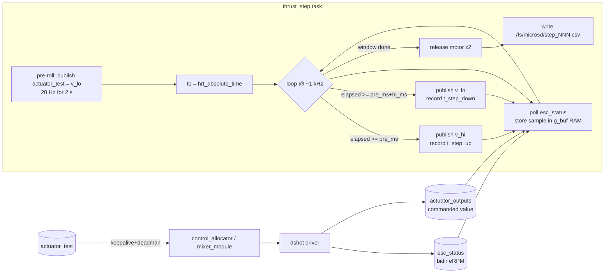

# thrust_step — motor step-response capture pipeline

> [!abstract] What this is
> A custom PX4 module (`thrust_step`) that commands a single motor through a
> **step change in throttle** and logs the rotor's **bidirectional-DShot eRPM
> response** at ~1 kHz into a CSV on the SD card, with **zero filesystem I/O
> during the transient**. Purpose: measure the rotor **mechanical time
> constant** $\tau_m$ on a bench stand.

Related files: [[thrust_step.cpp]] · [[CMakeLists.txt]] · [[Kconfig]]

---

## 1. Goal & physics

We want the **mechanical** time constant of a small rotor:

$$\tau_m = \frac{J R}{k_t^2}$$

with $J \approx 1.2\times10^{-6}\ \text{kg·m}^2$ for a loaded 3″ prop.

> [!note] Expected values
> - **Loaded (props on):** $\tau_m \approx 8\text{–}15\ \text{ms}$
> - **Free-spin (props off):** faster rise in the *command→RPM* sense but the
>   measurement is dominated by motor + ESC governor dynamics, not aero load.
>   We measured $\tau \approx 22\text{–}24\ \text{ms}$ free-spin (see §12).

> [!warning] The 90 µs figure is a red herring
> A "90 µs" constant quoted by a third party is the **electrical** constant
> $L/R \approx 50\text{–}150\ \mu s$. Rotor inertia low-passes it away — it is
> **not observable through eRPM**. Do **not** design the sampling around it.
> ~1 kHz eRPM sampling is more than enough for a 10 ms mechanical constant
> (≈ 10 samples per $\tau$).

---

## 2. System under test

| Item | Value |
|---|---|
| Flight controller | Holybro **Kakute H7** v1.3 (STM32H743, board_id 1048) |
| PX4 board target | `holybro_kakuteh7_default` |
| ESC | Tekko32 F4 4-in-1 (BLHeli32) |
| Motors | ~1404-class, assumed 12N**14P** (14 poles) until verified |
| Props | 3″ — **removed during bring-up**, fit later |
| RC | none — bench only, vehicle **never armed** |
| PX4 source | `v1.18.0-beta1-454-gb4bcbb22fb`, working tree `~/telemtry_test/PX4-Autopilot` |
| Toolchain | `arm-none-eabi-gcc` 10.3.1, ninja 1.10, Python 3.10 |

> [!danger] Bench safety
> `thrust_step` **spins a real motor**. Vehicle disarmed, props off or secured,
> stay out of the plane of rotation. Every `actuator_test` publish carries a
> **500 ms deadman** (`KEEPALIVE_TIMEOUT_MS`): if the task is killed / crashes /
> blocks, the control allocator drops the motor to disarmed within 500 ms.

---

## 3. High-level design

The transient is short (tens of ms) and we need it clean. Three constraints
drove the design:

1. **No filesystem I/O during the capture.** An SD write stall (tens of ms on a
   cheap card) would punch a hole straight through the transient. → Sample into
   a **static RAM buffer**, flush to CSV only *after* releasing the motor.
2. **Command the motor without arming.** → Use the **`actuator_test`** uORB
   topic, the same mechanism QGC's motor sliders use. Works while disarmed.
3. **Timestamp each step precisely.** → Record `hrt_absolute_time()` at the exact
   `orb_publish` call for the up-step *and* the down-step.

> [!note] Rise **and** fall in one capture
> A run now steps `v_lo → v_hi` (rise), holds, then steps `v_hi → v_lo` (fall)
> and keeps logging. One CSV yields both time constants. The down-step is
> skipped with `-r 0`.



**Sequence of a run (`thrust_step -m 1`, defaults):**

| phase | duration | what happens |
|---|---|---|
| spin-up | 2.0 s (40 × 50 ms) | motor held at `v_lo` = 0.40, rotor reaches steady state |
| instance scan | 0.3 s | sweep `actuator_outputs` instances/channels, lock onto the one driving this motor |
| pre-roll | `pre_ms` = 300 ms | capture at `v_lo` |
| **up-step** | 1 cycle | publish `v_hi` = 0.55, record `t_step_up` |
| high hold | `hi_ms` = 300 ms | capture the **rise** |
| **down-step** | 1 cycle | publish `v_lo` = 0.40, record `t_step_down` (skipped if `-r 0`) |
| low hold | `lo_ms` = 300 ms | capture the **fall** |
| release | ~0.1 s | 2× `ACTION_RELEASE_CONTROL` |
| flush | ~10–100 ms | CSV written to SD |

Total capture window (defaults) = 300 + 300 + 300 = **900 ms** → ~900 samples at 1 kHz.

---

## 4. Key design decisions

| Decision | Rationale |
|---|---|
| Static 96 kB `.bss` buffer (`MAX_SAMPLES = 8000 × 12 B`) | Lands in AXI_SRAM (plenty free, see §7). 8 s at 1 kHz. No heap, no stack blow-up, no I/O in the hot path. |
| `struct sample_s` = 12 bytes (`u32 t_us, i32 rpm, u16 out_raw, u16 v_cv`) | Small → 8000 samples fit in 96 kB. `t_us` is **relative to `t0`** so 32 bits is enough (< 4295 s). |
| Command via `actuator_test`, not by arming | Only way to spin one motor on a disarmed bench. Matches `src/systemcmds/actuator_test`. |
| Re-publish `actuator_test` at **20 Hz** (50 ms) | `mixer_module` ignores `actuator_test` messages older than **100 ms** (`src/lib/mixer_module/actuator_test.cpp:54`). 50 ms clears it with margin. |
| `timeout_ms = 500` on every publish (deadman) | v1.18 `actuator_test` has **no "stopped hearing messages" auto-stop** — only explicit release or a non-zero `timeout_ms`. Without this a killed task leaves the motor spinning forever. 500 ms ≫ 50 ms republish, so it never trips mid-run. |
| `px4_poll(esc_status, 2 ms)` in the loop | Block on the eRPM report (the measured signal), but cap the wait so the step still fires near its nominal time if telemetry stalls. |
| Record `out_raw` from `actuator_outputs` | The *true* input step, post-mixing / thrust-curve / output-limiting. Its transition (not the header `t_step_us`) is the correct $t=0$ for fitting — see §13. |
| Both step edges in one run (`v_lo→v_hi→v_lo`) | Rise and fall time constants from a single capture; the motor is already hot and at a known operating point, so the two transients share conditions. |
| Auto-incrementing filename `step_NNN.csv` | Repeated runs never overwrite. |

---

## 5. PX4 v1.18 internals that shaped the module

> [!info] These were verified against the generated headers in
> `build/holybro_kakuteh7_default/uORB/topics/` and the message definitions in
> `msg/`, **not** assumed from older PX4.

### 5.1 `actuator_test` (`msg/ActuatorTest.msg`)
- `FUNCTION_MOTOR1 = 101`, `ACTION_DO_CONTROL = 1`, `ACTION_RELEASE_CONTROL = 0` — unchanged.
- `value` range **[-1, 1]**; for a non-reversible motor the handler internally
  remaps `[0,1] → [-1,1]` and applies the thrust curve (`THR_MDL_FAC`).
- Staleness window: **100 ms** (not the ~200 ms quoted in older docs).
- **No auto-stop** without `timeout_ms > 0`.

### 5.2 `esc_status` / `EscReport` (`msg/EscStatus.msg`, `msg/EscReport.msg`)
- `esc_status_s::CONNECTED_ESC_MAX = 12` (was `ESC_STATUS_MAX` in old PX4).
- `esc_status.esc[i]` is indexed by **motor index** (Motor1 → `esc[0]`).
- `esc[i].esc_rpm` is `int32`, **already mechanical RPM** — the dshot driver
  divides electrical eRPM by `pole_count / 2` using `DSHOT_MOT_POL<i>`.
- `esc[i].esc_power` is **not populated** by the dshot driver in this version
  (would need Extended DShot Telemetry). Don't rely on it.

### 5.3 `esc_status` publish rate — the pipeline, not the driver
`esc_status` is published **once per DShot output frame**. Output frames are
driven by:

```
gyro loop (IMU_GYRO_RATEMAX, default 400 Hz)
  → mc_rate_control publishes vehicle_torque_setpoint   [only if flag_control_rates_enabled]
  → control_allocator publishes actuator_motors         [only if flag_control_allocation_enabled]
  → DShot::Run() → esc_status
```

`control_allocator` and `mixer_module` each have a **hardcoded 50 ms (20 Hz)
backup schedule**. So:

> [!warning] Rate gate
> If the FC is **disarmed with no rates-enabled mode active**, the whole chain
> free-runs at **~20 Hz** and `esc_status` timestamps come out ~50 ms apart —
> buffering cannot fix that. In practice on this bench we observed a solid
> **~1 kHz** (median Δt 1001 µs), so the pipeline *was* running fast — but if a
> future capture shows ~50 ms spacing, the fix is upstream:
> - `IMU_GYRO_RATEMAX = 1000` or `2000` (default 400 → 2.5 ms floor)
> - hold a rates-enabled mode while disarmed: `commander mode acro`
> - `COM_RC_IN_MODE = 1` so the missing RC doesn't force failsafe
> Diagnose with `listener actuator_motors -n 20` vs `listener esc_status -n 20`.

### 5.4 Bidirectional DShot — there is **no `DSHOT_BIDIR_EN`** on v1.18
Bidirectional is selected **per output timer** on the QGC **Actuators page**:
protocol `DShot600 (Bidirectional)` maps to `TIM_CONFIG_BDSHOT600`. Plain
`DShot600` sends **no eRPM back** → `esc_rpm` stays 0.
- `DSHOT_BIDIR_EDT` only toggles *Extended* DShot Telemetry, not bidir itself.
- Check with `dshot status`: want `BDShot Telemetry: Enabled`, channel
  `Online`, `BDShot Err` not climbing.

### 5.5 Two `actuator_outputs` instances
This board builds **both** `CONFIG_DRIVERS_DSHOT` and `CONFIG_DRIVERS_PWM_OUT`.
`actuator_outputs` is a `PublicationMulti` — each output driver publishes its
**own instance**. And **motor _N_ is not necessarily on output channel _N−1_** —
it depends on the Actuators-page assignment. The module resolves both at
runtime (see §8, bug #2).

---

## 6. Changes to the stock PX4 repo

> [!important] Everything is contained to the module directory + one board line.
> No core PX4 files were modified.

### New files (untracked)
```
src/modules/thrust_step/
├── thrust_step.cpp     # the module
├── CMakeLists.txt      # px4_add_module(MODULE modules__thrust_step, MAIN thrust_step, STACK_MAIN 4096)
├── Kconfig             # menuconfig MODULES_THRUST_STEP
└── notes.md            # this file
```

### Modified: `boards/holybro/kakuteh7/default.px4board`
```diff
 CONFIG_MODULES_SIMULATION_SIMULATOR_SIH=y
+CONFIG_MODULES_THRUST_STEP=y
 CONFIG_MODULES_UXRCE_DDS_CLIENT=y
```

### Kconfig / CMake wiring
`src/modules/Kconfig` does `rsource "*/Kconfig"`, so the new `Kconfig` is picked
up automatically. `cmake/kconfig.cmake:236` maps `CONFIG_MODULES_THRUST_STEP=y`
→ `src/modules/thrust_step` in `config_module_list`. Verify with:
```
grep -c thrust_step build/holybro_kakuteh7_default/build.ninja        # → 47
grep -a thrust_step build/holybro_kakuteh7_default/NuttX/px4.bdat     # → { "thrust_step", ..., thrust_step_main }
```

### Build tree note
> [!tip] Do **not** run `make distclean` — it calls `git clean -ff -x -d` and
> would delete `src/modules/thrust_step/` (untracked). To wipe the build:
> `rm -rf build/holybro_kakuteh7_default`.
>
> A stale `build/` cache with absolute paths from a *different* checkout
> (`~/px4-reference`) is what makes `make` loop re-running CMake. This working
> tree was clean — no such cache — so no fix was needed here.

---

## 7. Memory budget

Linker report for `holybro_kakuteh7_default` **with** the module:

| Region | Used | Size | % | Headroom |
|---|---|---|---|---|
| **FLASH** | 1 803 196 B | 1792 kB | **98.27 %** | **≈ 29 kB** |
| **AXI_SRAM** | 142 240 B | 512 kB | 27.13 % | ≈ 373 kB |
| DTCM / SRAM1-4 | ~0 | — | ~0 % | — |

- The **96 kB `g_buf`** buffer is the AXI_SRAM bump (46 kB → 142 kB). Not a
  problem — `MAX_SAMPLES` could go higher.
- **FLASH is the tight resource.** The module added ~3.5 kB. If future edits
  overflow, drop the fixed-wing / VTOL modules from the `.px4board`
  (`FW_ATT_CONTROL`, `FW_RATE_CONTROL`, `FW_MODE_MANAGER`, `VTOL_ATT_CONTROL`…)
  — dead weight for a bench quad.

---

## 8. The module in detail

### CLI
```
thrust_step [-m N] [-l LOW] [-h HIGH] [-p PRE_MS] [-q HI_MS] [-r LO_MS] [-e IDX] [-s]
  -m N       motor index, 1-based                (default 1)
  -l LOW     low setpoint, 0..1                  (default 0.40)
  -h HIGH    high setpoint, 0..1                 (default 0.55)
  -p PRE_MS  hold at LOW before the up-step, ms  (default 300)
  -q HI_MS   hold at HIGH between the steps, ms  (default 300)   ← rise window
  -r LO_MS   hold at LOW after the down-step, ms (default 300)   ← fall window; 0 = up-step only
  -e IDX     esc_status array index              (default = motor-1)
  -s         print CSV to console instead of writing to SD
```
- **Rise + fall (default):** `thrust_step -m 1` → `v_lo → v_hi → v_lo`, both edges logged.
- **Rise only:** `thrust_step -m 1 -r 0`.
- **Deeper step:** `thrust_step -m 1 -l 0.30 -h 0.70`.
- **Longer settle:** `thrust_step -m 1 -q 500 -r 500`.

### uORB interface
| Topic | Direction | Use |
|---|---|---|
| `actuator_test` | publish (advertise + 20 Hz) | take/hold/step/release the motor |
| `esc_status` | subscribe (`px4_poll`) | bidir eRPM — the measured signal |
| `actuator_outputs` | subscribe ×4 instances | commanded DShot value (`out_raw`) |
| `battery_status` | subscribe | pack voltage (informational) |

### CSV format
```
# motor=1 esc_index=0 v_low=0.4000 v_high=0.5500
# t_step_us=300049  (up step: subtract from t_us for t=0 at the rise)
# t_step_down_us=600120  (down step: t=0 for the fall; 0 = no down step)
# samples=858
t_us,rpm,out_raw,v_volt
697,39683,1006,1.91
...
```
| column | meaning | units |
|---|---|---|
| `t_us` | `esc.timestamp - t0` | µs, relative to capture start |
| `rpm` | `esc_status.esc[esc_idx].esc_rpm` | mechanical RPM (needs correct `DSHOT_MOT_POLn`) |
| `out_raw` | `actuator_outputs.output[chan]` for the resolved instance/channel | DShot throttle units, 0…`DSHOT_MAX_THROTTLE` (1999) |
| `v_volt` | `battery_status.voltage_v` | V |

---

## 9. Bugs found during bring-up & their fixes

> [!bug] #1 — first sample `t_us = 4294967065`
> The first `esc_status` pulled right after `orb_subscribe` can carry a
> timestamp **older than `t0`**; the unsigned `(esc.timestamp - t0)` wrapped to
> ≈ 4.29e9.
> **Fix:** skip samples with `esc.timestamp < t0`.

> [!bug] #2 — `out_raw` stuck at 0
> The module read `actuator_outputs` **instance 0**, which on this board is
> `pwm_out` (no motors), and assumed **channel `motor-1`**. Both wrong.
> **Fix:** after spin-up, while only the test motor is turning, sweep for
> 300 ms across **all 4 instances × all channels** and lock onto the
> `(instance, channel)` carrying the largest live value. Prints:
> `INFO [thrust_step] actuator_outputs: instance N channel N (spin-up value ~1006)`

> [!bug] #3 — misleading error text
> The "no samples" message referenced `DSHOT_BIDIR_EN`, which doesn't exist on
> v1.18.
> **Fix:** message now points at the Actuators-page Bidirectional-DShot setting
> and `dshot status`. Also added an end-of-run warning if every eRPM sample is 0.

> [!note] `rpm = 0` on the first hardware run
> Motor spun, `esc_status` published at 1 kHz, but `esc_rpm` was 0 for the whole
> trace. The board *was* set to BDShot600 from the start, so the exact trigger
> was never pinned down — most likely an ESC-side bidirectional / RPM-telemetry
> toggle that came good, or the reboot between runs. Resolved; eRPM has
> populated on every run since.

---

## 10. Build & flash (from a terminal)

From repo root `~/telemtry_test/PX4-Autopilot`, **QGC disconnected** (the USB
port is exclusive):

```bash
# build only
make holybro_kakuteh7_default

# build + flash (~25 s)
make holybro_kakuteh7_default upload

# wipe build (never `make distclean`)
rm -rf build/holybro_kakuteh7_default
```

> [!tip]
> - `upload` reboots the board to its bootloader over
>   `/dev/serial/by-id/usb-Holybro_PX4_KakuteH7_0-if00`, then erases / programs /
>   verifies.
> - Hangs on *"Waiting for bootloader…"* > 30 s → **unplug/replug USB**.
> - User is in `dialout`, no `sudo` needed.

### Getting an `nsh` console
```bash
./Tools/mavlink_shell.py /dev/ttyACM0      # QGC must be disconnected
```
or **QGC → Analyze Tools → MAVLink Console** (works with QGC connected).

---

## 11. QGC / parameter configuration

> [!checklist] One-time setup
> - [ ] **Actuators page** → assign **Motor 1** (and others) to outputs.
> - [ ] **Actuators page** → set the motor output timer protocol to
>       **`DShot600 (Bidirectional)`** — *not* plain DShot600. Reboot.
> - [ ] Parameter editor → `DSHOT_MOT_POL1 = 14` (verify against the actual
>       magnet count on the bell).
> - [ ] `IMU_GYRO_RATEMAX = 2000` (default 400). Reboot. *(only needed if the
>       rate gate in §5.3 bites — we saw 1 kHz without it)*
> - [ ] `COM_RC_IN_MODE = 1` so the missing RC receiver doesn't force failsafe.
> - [ ] Confirm the SD card is inserted and mounted (`ls /fs/microsd`).

Parameters that live **on the Actuators page**, not the plain parameter editor:
output → function assignment, and the per-timer **protocol** (where
Bidirectional DShot is chosen).

---

## 12. Running the experiment & typical values

> [!example] Procedure
> 1. `./Tools/mavlink_shell.py /dev/ttyACM0`
> 2. *(optional, if rate gate bites)* `commander mode acro`
> 3. Sanity check — **motor 1 spins at ~15 % for 5 s**:
>    `actuator_test set -m 1 -v 0.15 -t 5`
>    then during the spin: `dshot status` and `listener esc_status -n 10`
>    (`esc[0].esc_rpm` must be non-zero).
> 4. Capture — **motor 1: 2 s spin-up, step 40 %→55 % (rise), hold, step 55 %→40 % (fall)**:
>    `thrust_step -m 1`
> 5. Watch the console for
>    `actuator_outputs: instance N channel N (spin-up value ~1006)`
>    and `captured N samples ... (up @ ~300000 us , down present)`.
> 6. CSV → `/fs/microsd/step_00N.csv`. Copy off the card.

### Typical values (props **off**, USB power, `-l 0.40 -h 0.55`, rise + fall)

| quantity | observed | note |
|---|---|---|
| samples | ~858 over ~900 ms | `pre_ms + hi_ms + lo_ms` window |
| sample spacing | median **1001 µs**, ~5 % of rows at ~2 ms | one dropped eRPM frame here and there |
| `t_step_us` (up) | ~300 000 | = `pre_ms` |
| `t_step_down_us` | ~600 000 | = `pre_ms + hi_ms` |
| `out_raw` at LOW | **~1006** (DShot units) | ≈ 0.40 cmd through thrust curve + limiter |
| `out_raw` at HIGH | **~1282** | ≈ 0.55 cmd |
| `out_raw` transition lag | **~1.5–2 ms after each `t_step*_us`** | control-allocator/mixer latency + 1 ms eRPM granularity |
| `rpm` at LOW | **~39 600** ± 200 | **free-spin**, no prop load |
| `rpm` at HIGH | **~50 000** ± 270 | free-spin |
| rise (63 %) | **t ≈ 22–24 ms** after the up-step | free-spin $\tau_\uparrow$ |
| fall (to 37 % of the drop) | **expected similar order**, often *slower* than the rise | no active braking — the rotor coasts down against bearing + windage only (with props, aero drag speeds it up) |
| `v_volt` | ~1.9 V | **no battery pack** — USB only, ignore |

> [!tip] With props fitted, expect `rpm` values several-fold lower (real aero
> load) and $\tau$ moving toward the predicted 8–15 ms — unless the Tekko32's
> internal throttle ramp / RPM governor sets the dominant pole, in which case
> you're measuring the ESC, not the rotor.

---

## 13. Analysis guidance

> [!important] Anchor $t=0$ at the `out_raw` transition, **not** `t_step_us` /
> `t_step_down_us`. `out_raw` changes ~2 ms after the module published each step.
> That lag is pipeline latency, not rotor dynamics — anchoring at the header
> timestamps biases $\tau$ high by ~2 ms. There are **two** `out_raw` edges now
> (up near `t_step_us`, down near `t_step_down_us`); fit each transient
> separately.

- **Split the file into two windows:** `[t_step_us, t_step_down_us)` = the
  **rise**, `[t_step_down_us, end)` = the **fall**. Fit each independently.
- **Use the real `t_us` column.** Sampling is ~1 kHz but not uniform (dropped
  frames). Fit $\omega(t)$ against actual timestamps; don't resample to a fixed
  grid before fitting.
- **First-order fit (rise):** $\omega(t) = \omega_{hi} - (\omega_{hi} - \omega_{lo})\,e^{-(t-t_0)/\tau_\uparrow}$
- **First-order fit (fall):** $\omega(t) = \omega_{lo} + (\omega_{hi} - \omega_{lo})\,e^{-(t-t_1)/\tau_\downarrow}$
  with $\omega_{lo}, \omega_{hi}$ from the flat plateaus (mean of the settled
  regions before the up-step and before the down-step).
- $\tau_\uparrow \ne \tau_\downarrow$ in general: spin-up is motor-torque-limited,
  spin-down is drag-limited. Props-off, the fall is usually the *slower* of the
  two (nothing but bearing friction + windage to decelerate the rotor).
- **Pole count:** if absolute RPM looks wrong (too high/low by an integer
  factor), `DSHOT_MOT_POL1` is mismatched. It only scales RPM — $\tau$ is
  unaffected — but fix it for correct absolute numbers.
- Drop the first row if it still shows a wrapped `t_us` (should be fixed now).

---

## 14. Troubleshooting

| Symptom | Likely cause | Check / fix |
|---|---|---|
| `make` re-runs CMake forever | stale `build/` cache from another checkout | `rm -rf build/holybro_kakuteh7_default` |
| `upload`: *Device or resource busy* | QGC (or a shell) holds the port | disconnect QGC; close other `mavlink_shell` |
| `upload` hangs at *Waiting for bootloader* | auto-reboot didn't take | unplug/replug USB |
| `thrust_step`: "no esc_status samples" | telemetry not flowing | `dshot status`, `listener esc_status` |
| `rpm` all 0, motor spins | bidir DShot off, or ESC not sending eRPM | Actuators page → `DShot600 (Bidirectional)`; enable RPM telem in BLHeli32 |
| `rpm` all 0, motor does **not** spin | outputs not assigned | Actuators page → assign Motor 1 |
| `esc_status` ~50 ms apart | rate-gate: pipeline at 20 Hz backup | `commander mode acro` + `IMU_GYRO_RATEMAX` (see §5.3) |
| `out_raw` all 0 | (pre-fix) wrong instance/channel | rebuilt module resolves at runtime; check the `instance N channel N` console line |
| `rpm` absolute value off by ~2× | `DSHOT_MOT_POL1` wrong | set to real magnet count |
| CSV not written | SD not mounted | `ls /fs/microsd`; reseat card |

---

## 15. Open items / future work

- [x] Capture the **fall** transient in the same run (`-r LO_MS`, default 300).
- [ ] Verify `DSHOT_MOT_POL1` against the physical motor (magnet count).
- [ ] Repeat with **props fitted** and compare $\tau_\uparrow$, $\tau_\downarrow$.
- [ ] Characterise whether the Tekko32 applies a throttle slew / governor
      (step several amplitudes; a rate-limited ESC shows amplitude-dependent
      apparent $\tau$).
- [ ] Consider logging `esc_status.esc[i].esc_power` if Extended DShot Telemetry
      (`DSHOT_BIDIR_EDT`) is enabled — gives an independent applied-power trace.
- [ ] Decide whether to commit `src/modules/thrust_step/` to a branch.
- [ ] If FLASH gets tight, trim FW/VTOL modules from the `.px4board`.
